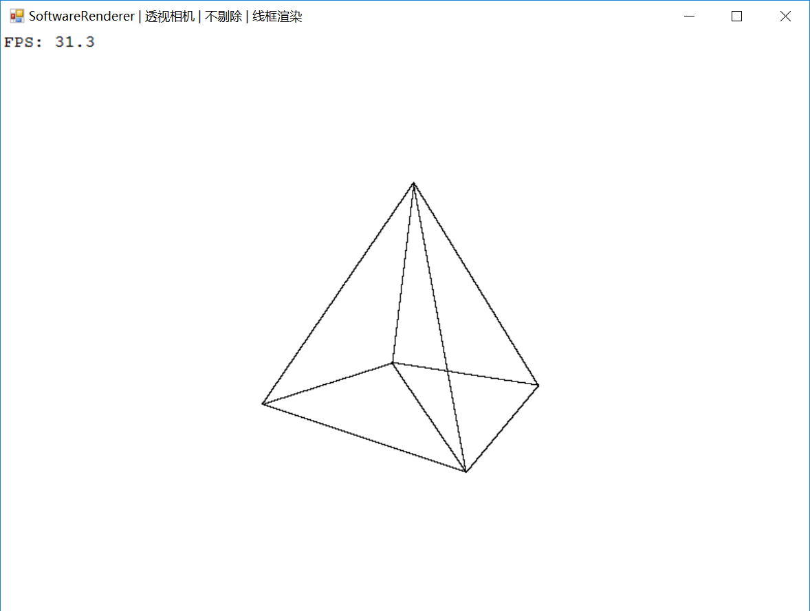

# SoftwareRenderer
个人为学习图形学和熟悉固定管线流程,使用C#（基于.net framework 4.6）写的软光栅器，未考虑任何性能优化。在较为陌生的知识点上都标注了参考文献的链接。

采用左手坐标系，Model/View/Perspective Projection矩阵。代码里有VertexShader和FragmentShader两个类，但并不具备真正的Shader功能：
* VertexShader仅完成顶点变换。
* FragmentShader仅完成颜色拷贝和纹理采样（如果以后增加了光源，这里可能会尝试实现不同的光照方程）。

## 效果图
RENDER_WIREFRAME模式

RENDER_COLOR模式

## 控制
方向键左/右：旋转物体。 
方向键上/下：拉动相机。 

数字键1：切换到线框模式。 
数字键2：切换到颜色模式。 

数字键8：开启背面剔除。 
数字键9：开启正面剔除。 
数字键0：关闭剔除。 

字母键O：切换到正交相机。 
字母键P：切换到透视相机。 

## TODO
裁剪 
法线变换 

## 最重要的
本人目前处在图形学的学习阶段，代码中肯定有各种错误（尤其是对知识点理解的错误），如果您发现了请一定给我发邮件不吝赐教：xieheng84@163.com，我会非常感激！
